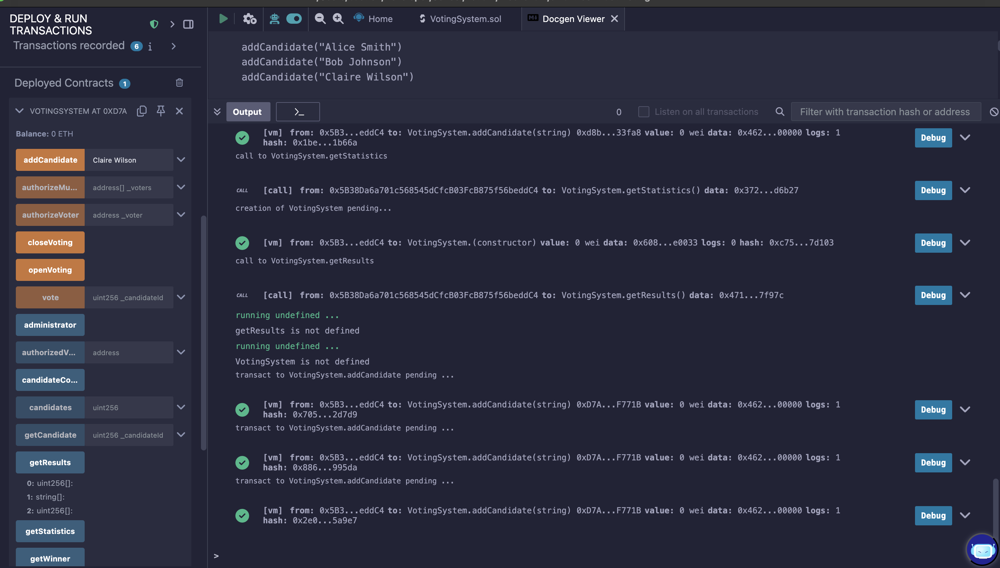
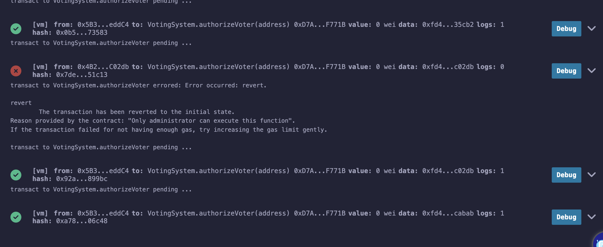
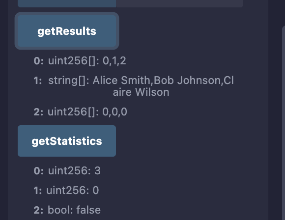
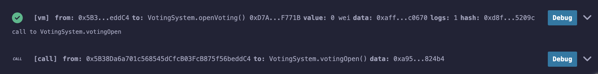
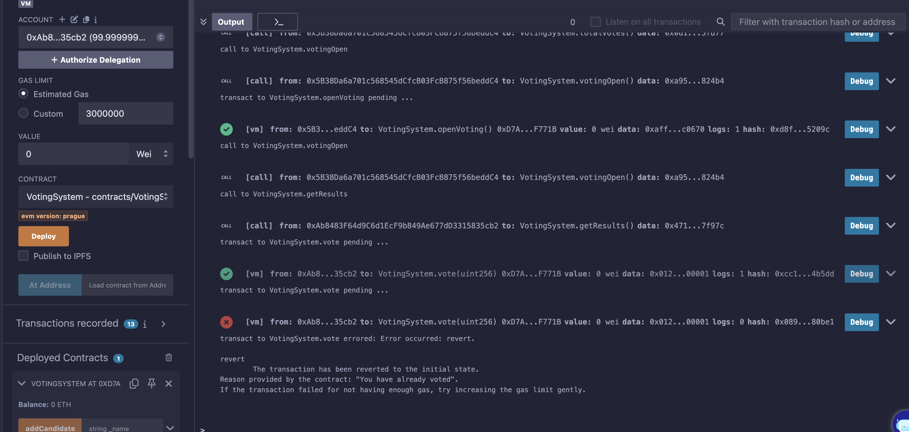
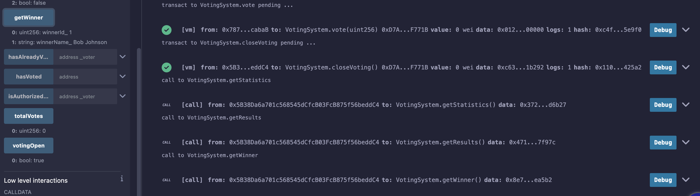

# Rendu du devoir pratique – Projet Blockchain : Système de vote

Lien vers le repo GitHub : [https://github.com/bbombardella/smart-contract-voting](https://github.com/bbombardella/smart-contract-voting)

## Composition de l'équipe : 

- Bastien BOMBARDELLA (Estiam E5 WMD Lyon)
- Bartholomé GILI (Estiam E5 WMD Lyon)
- Noé FAVIER (Estiam E5 WMD Lyon)
- Kilian VEST (Estiam E5 WMD Lyon)
- Florian HAVARD (Estiam E5 WMD Lyon)

## Résumé expliquant qui a fait quoi dans l’équipe

### Bartholomé GILI

- Mise en place du smart contract principal en Solidity.
- Implémentation de la logique de gestion des candidats (ajout, stockage, accès).
- Vérification de la bonne structuration des fonctions d’administration.

### Noé FAVIER

Développement de la partie sécurité du vote :

- Gestion de l’autorisation des électeurs.
- Vérification qu’un électeur ne peut voter qu’une seule fois.
- Réalisation des tests d’intégrité des votes (tentatives de double vote, vote non autorisé).

### Kilian VEST

- Conception et gestion des différents états du vote (ouverture, fermeture).
- Ajout des restrictions pour empêcher certaines actions au mauvais moment (ex. pas d’ajout de candidat après ouverture du vote).
- Contribution aux tests de gestion des états.

### Bastien BOMBARDELLA

- Développement des fonctions de consultation publique :
  - `getResults()`
  - `getWinner()`
  - `getStatistics()`
- Mise en place des tests fonctionnels pour vérifier l’exactitude des résultats et l’identification correcte du gagnant.

### Florian HAVARD

- Rédaction du guide d’utilisation (README) avec scénarios de test détaillés.
- Organisation des cas de simulation (ajout de candidats, votes simulés, résultats attendus).
- Coordination générale et validation finale du bon fonctionnement du projet.

## Captures d'écran de l'exécution du smart contract

1. Ajout de candidats au vote
    

2. Ajout des votants éligibles (seulement par le rôle admin, sinon une erreur se produit) :
    

3. Récupération des stats du vote : 
    

4. Ouverture du vote :
    

5. Vote via différents comptes (possible de voter qu'une seule fois, sinon une erreur se produit) :
    

6. Récupération du gagnant : 
    
